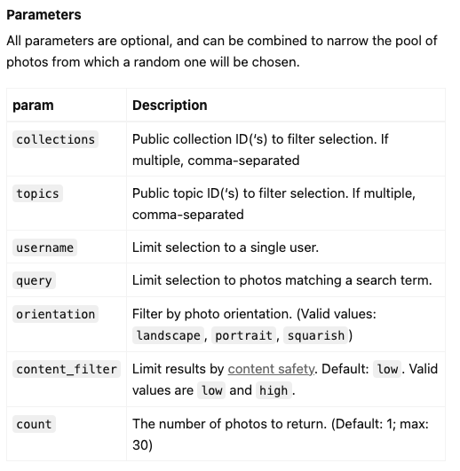

# Screen-Scroll

### This side project load the images from Unsplash api [random-photo-api](https://unsplash.com/documentation#get-a-random-photo)



Fetch the image by API:
```js
const apiUrl = `https://api.unsplash.com/photos/random/?client_id=${apiKey}&count=${count}`;

let photosArray = [];

async function getPhotos() {
    try {
        const response = await fetch(apiUrl);
        photosArray = await response.json();
        console.log(photosArray);
    } catch (error) {

    }
}
```
<br/>

When scrolling near the bottom of page and image is loaded, load more photos:
```js

window.addEventListener('scroll', () => {
    if (window.innerHeight + window.scrollY >= document.body.offsetHeight - 1000 && ready) {
        ready = false;
        getPhotos();

    }
})
```
```js
function imageLoaded() {
    imagesLoaded++;
    console.log(imagesLoaded);
    if (imagesLoaded === totalImages) {
        ready = true;
        loader.hidden = true;
        console.log('ready = ', ready);
    }
}
```

### The Webpage icon is get from [flaticon](https://www.flaticon.com/)
```html
<link rel='icon' type="image/png" href="./image/camera.png">
```

### The font style is get from [google font](https://fonts.google.com/specimen/Bebas+Neue/tester?preview.text=Scroll%20Screen&preview.text_type=custom&query=Bebas)
```css
@import url('https://fonts.googleapis.com/css2?family=Bebas+Neue&display=swap');
body {
    font-family: Bebas Neue, sans-serif;
}
```
